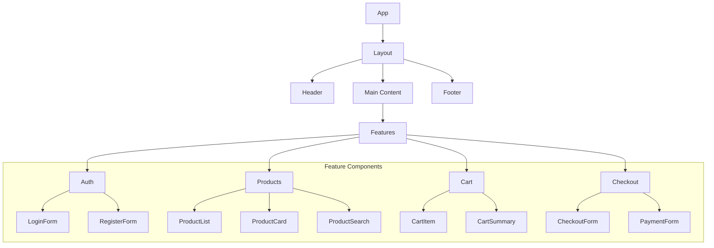
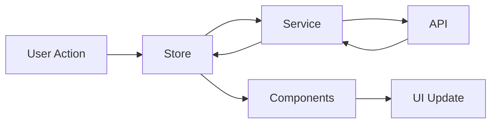
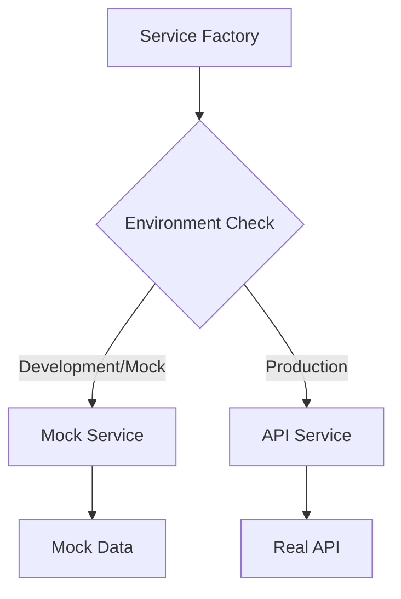

# Trinity Frontend

A modern, accessible, and dark-mode compatible SolidJS application with a component library built using Tailwind CSS.

## 📋 Table of Contents

- [Features](#features)
- [Project Structure](#project-structure)
- [Component Architecture](#component-architecture)
- [State Management](#state-management)
- [Getting Started](#getting-started)
- [Development](#development)
- [Best Practices](#best-practices)
- [Component Best Practices](#component-best-practices)
- [Code Best Practices](#code-best-practices)

## ✨ Features

- 🎨 Modern UI with dark mode support
- 📱 Responsive design
- ♿ Accessibility focused
- 🔍 Type-safe with TypeScript
- 🎯 Component-driven development
- 🔄 Efficient state management
- 🚀 Fast development workflow

## 🏗 Project Structure

```
src/
├── assets/              # Static assets
│   └── images/         # Image files
├── components/          # UI components
│   ├── ui/            # Base UI components
│   ├── common/        # Shared components
│   ├── forms/         # Form components
│   ├── layout/        # Layout components
│   └── features/      # Feature components
├── hooks/              # Custom hooks
├── lib/                # Utilities
├── routes/             # Page components
├── services/           # API services
├── stores/             # State management
├── types/              # TypeScript types
└── app.tsx             # Root component
```

## 🎨 Component Architecture



## 🔄 State Management Flow



## 🔌 Services & Mocking

### Service Architecture

The application uses a service layer pattern with mock capabilities for development and testing. The architecture is designed to easily switch between mock and real API implementations.



### Service Structure
```
services/
├── api/                 # Real API implementations
│   └── products.service.ts
├── mock/               # Mock service implementations
│   └── products.mock.service.ts
├── service.factory.ts  # Service creation & configuration
└── types/             # Service interfaces
    └── services.ts
```

### Using Mock Services

The mock service system provides:
- Realistic API behavior simulation
- Configurable network delays
- Random error simulation
- Type-safe implementations
- Easy switching between mock and real APIs

#### Configuration

Mock services can be configured using environment variables:

```env
# Force mock service usage
VITE_USE_MOCK=true

# API configuration
VITE_API_KEY=your_api_key
```

#### Environment-based Configuration

```typescript
// service.factory.ts
const config = {
    development: {
        baseUrl: "http://localhost:3000/api"
    },
    staging: {
        baseUrl: "https://staging-api.example.com"
    },
    production: {
        baseUrl: "https://api.example.com"
    }
};
```

#### Mock Service Features

1. **Simulated Network Behavior**
   ```typescript
   // Configurable delay simulation
   await simulateDelay(500); // 500ms delay
   
   // Random error simulation (20% chance)
   simulateError();
   ```

2. **Type-Safe Interface**
   ```typescript
   interface ProductService {
       getProducts(): Promise<Product[]>;
       getProduct(id: string): Promise<Product | null>;
       searchProducts(query: string): Promise<Product[]>;
   }
   ```

3. **Mock Data Management**
   ```typescript
   // mocks/products.mock.ts
   export const mockProducts = [
       {
           id: "1",
           name: "Product",
           // ...
       }
   ];
   ```

### Switching to Real API

To use the real API implementation:

1. Set environment variables:
   ```env
   VITE_USE_MOCK=false
   VITE_API_KEY=your_api_key
   ```

2. Update API configuration in `service.factory.ts`:
   ```typescript
   const config = {
       production: {
           baseUrl: "https://your-api-url.com"
       }
   };
   ```

3. The application will automatically use the real API service with no component changes needed.

### Best Practices

1. **Service Usage in Stores**
   ```typescript
   const productService = createProductService();
   
   export const useProducts = () => {
       const fetchProducts = async () => {
           try {
               const products = await productService.getProducts();
               // Handle success
           } catch (error) {
               // Handle error
           }
       };
       // ...
   };
   ```

2. **Error Handling**
   ```typescript
   try {
       await productService.getProduct(id);
   } catch (error) {
       if (error instanceof ApiError) {
           // Handle API-specific error
       }
       // Handle general error
   }
   ```

3. **Testing with Mocks**
   ```typescript
   // Force mock service in tests
   process.env.VITE_USE_MOCK = "true";
   
   test("fetches products", async () => {
       const service = createProductService();
       const products = await service.getProducts();
       expect(products).toBeDefined();
   });
   ```

## �� Getting Started

1. Clone the repository:
   ```bash
   git clone https://github.com/yourusername/trinity-frontend.git
   ```

2. Install dependencies:
   ```bash
   pnpm install
   ```

3. Start the development server:
   ```bash
   # Windows
   .\dev.bat

   # Unix/MacOS
   chmod +x dev.sh  # First time only
   ./dev.sh
   ```

The app will be available at `http://localhost:3000` with hot reload enabled.

## 💻 Development

### Component Structure

Each component follows a consistent structure:
- Props interface
- Component implementation
- Styles (Tailwind classes)
- Dark mode support
- Accessibility features

Example:
```tsx
interface ButtonProps {
  variant?: "primary" | "secondary" | "outline";
  size?: "sm" | "md" | "lg";
}

export const Button: Component<ButtonProps> = (props) => {
  // Component implementation
};
```

### State Management

We use Solid.js signals for state management:
```tsx
// Store definition
const [state, setState] = createSignal(initialValue);

// Component usage
const Component = () => {
  const store = useStore();
  return <div>{store.value()}</div>;
};
```

## 📚 Best Practices

1. **Component Organization**
   - Keep components small and focused
   - Use composition over inheritance
   - Follow the Single Responsibility Principle

2. **State Management**
   - Use local state when possible
   - Centralize shared state in stores
   - Keep state updates predictable

3. **Styling**
   - Use Tailwind CSS utility classes
   - Follow design system tokens
   - Ensure dark mode compatibility

4. **Performance**
   - Lazy load routes and components
   - Optimize re-renders
   - Use proper memoization

5. **Accessibility**
   - Include proper ARIA attributes
   - Ensure keyboard navigation
   - Maintain proper contrast ratios

## 🎯 Component Best Practices

### 1. Component Structure

```tsx
// 1. Imports
import { Component, createSignal, createEffect } from "solid-js";
import { useTheme } from "../../stores/theme";
import { Button } from "../ui/Button";

// 2. Types/Interfaces
interface CardProps {
  title: string;
  description?: string;
  onAction?: () => void;
  class?: string;
}

// 3. Component Definition
export const Card: Component<CardProps> = (props) => {
  // 3.1 Hooks and Signals
  const [isExpanded, setIsExpanded] = createSignal(false);
  const { isDark } = useTheme();

  // 3.2 Effects
  createEffect(() => {
    // Side effects here
  });

  // 3.3 Event Handlers
  const handleClick = () => {
    setIsExpanded(!isExpanded());
    props.onAction?.();
  };

  // 3.4 Render
  return (
    <div 
      class={clsx(
        "rounded-lg p-4",
        "bg-card text-card-foreground",
        "transition-colors duration-200",
        isDark() && "shadow-lg",
        props.class
      )}
      role="article"
    >
      <h2 class="text-lg font-semibold">{props.title}</h2>
      {props.description && (
        <p class="mt-2 text-muted-foreground">{props.description}</p>
      )}
      <Button onClick={handleClick} class="mt-4">
        {isExpanded() ? "Show Less" : "Show More"}
      </Button>
    </div>
  );
};
```

### 2. Props Best Practices

```tsx
// ✅ Good: Clear, typed props with defaults
interface ButtonProps {
  variant?: "primary" | "secondary" | "outline";
  size?: "sm" | "md" | "lg";
  isLoading?: boolean;
  disabled?: boolean;
  children: JSX.Element;
  onClick?: (e: MouseEvent) => void;
}

// ❌ Bad: Untyped or overly permissive props
interface BadProps {
  style: any;  // Avoid 'any'
  data: unknown;  // Too generic
  onEvent: Function;  // Use specific function types
}
```

### 3. Composition Patterns

```tsx
// ✅ Good: Composable components
export const Card: Component<CardProps> = (props) => (
  <div class="card">
    <CardHeader>{props.header}</CardHeader>
    <CardContent>{props.children}</CardContent>
    <CardFooter>{props.footer}</CardFooter>
  </div>
);

// Usage
<Card
  header={<h2>Title</h2>}
  footer={<Button>Action</Button>}
>
  <p>Content</p>
</Card>

// ❌ Bad: Monolithic components
export const BadCard: Component = () => (
  <div class="card">
    <div class="header">
      <h2>Hardcoded Title</h2>
    </div>
    <div class="content">
      <p>Hardcoded content</p>
    </div>
  </div>
);
```

## 💻 Code Best Practices

### 1. State Management

```tsx
// ✅ Good: Organized store with typed state
interface AuthState {
  user: User | null;
  isLoading: boolean;
  error: string | null;
}

const [state, setState] = createSignal<AuthState>({
  user: null,
  isLoading: false,
  error: null
});

export const useAuth = () => {
  const login = async (credentials: LoginCredentials) => {
    setState(prev => ({ ...prev, isLoading: true }));
    try {
      const user = await AuthService.login(credentials);
      setState(prev => ({ ...prev, user, error: null }));
    } catch (error) {
      setState(prev => ({ 
        ...prev, 
        error: error instanceof Error ? error.message : "Unknown error" 
      }));
    } finally {
      setState(prev => ({ ...prev, isLoading: false }));
    }
  };

  return {
    user: () => state().user,
    isLoading: () => state().isLoading,
    error: () => state().error,
    login
  };
};
```

### 2. Error Handling

```tsx
// ✅ Good: Proper error handling and loading states
export const ProductList: Component = () => {
  const { products, error, loading, fetchProducts } = useProducts();

  return (
    <div role="region" aria-label="Products">
      {loading() && <LoadingSpinner />}
      
      {error() && (
        <ErrorAlert 
          message={error()} 
          onRetry={fetchProducts}
        />
      )}
      
      {!loading() && !error() && products().length === 0 && (
        <EmptyState message="No products found" />
      )}
      
      {products().map(product => (
        <ProductCard 
          key={product.id}
          product={product}
        />
      ))}
    </div>
  );
};
```

### 3. Performance Optimization

```tsx
// ✅ Good: Optimized list rendering
export const TodoList: Component<{ todos: Todo[] }> = (props) => {
  // Memoize expensive computations
  const completedCount = createMemo(() => 
    props.todos.filter(todo => todo.completed).length
  );

  return (
    <For each={props.todos}>
      {(todo) => <TodoItem todo={todo} />}
    </For>
  );
};

// ❌ Bad: Unnecessary re-renders
export const BadTodoList: Component<{ todos: Todo[] }> = (props) => (
  <div>
    {props.todos.map(todo => (
      <div key={todo.id}>{todo.title}</div>
    ))}
  </div>
);
```

### 4. Accessibility

```tsx
// ✅ Good: Accessible form component
export const LoginForm: Component = () => {
  const [error, setError] = createSignal("");

  return (
    <form
      role="form"
      aria-label="Login form"
      onSubmit={handleSubmit}
    >
      <div role="group" aria-labelledby="credentials-heading">
        <h2 id="credentials-heading" class="sr-only">
          Login Credentials
        </h2>

        <Input
          id="email"
          type="email"
          label="Email"
          required
          aria-required="true"
          aria-invalid={!!error()}
          aria-describedby={error() ? "email-error" : undefined}
        />

        {error() && (
          <p
            id="email-error"
            class="text-destructive text-sm"
            role="alert"
          >
            {error()}
          </p>
        )}

        <Button
          type="submit"
          aria-busy={loading()}
          disabled={loading()}
        >
          {loading() ? "Logging in..." : "Login"}
        </Button>
      </div>
    </form>
  );
};
```

## 🔧 Available Scripts

- `pnpm dev` - Start development server
- `pnpm build` - Build for production
- `pnpm test` - Run tests
- `pnpm lint` - Run linter
- `pnpm format` - Format code

## 📦 Dependencies

- SolidJS - UI framework
- Tailwind CSS - Styling
- TypeScript - Type safety
- Vite - Build tool

## Documentation

### Router Configuration
For detailed information about our routing setup and best practices, see [Router Documentation](src/docs/router.md).

### Development

#### Getting Started
1. Install dependencies:
```bash
pnpm install
```

2. Start the development server:
```bash
pnpm dev
```

#### Building
```bash
pnpm build
```

### Project Structure
- `/src` - Source code
  - `/components` - Reusable components
  - `/pages` - Page components
  - `/stores` - State management
  - `/lib` - Utilities and helpers
  - `/docs` - Project documentation

### Technologies
- SolidJS
- TailwindCSS
- @solidjs/router
- TypeScript
