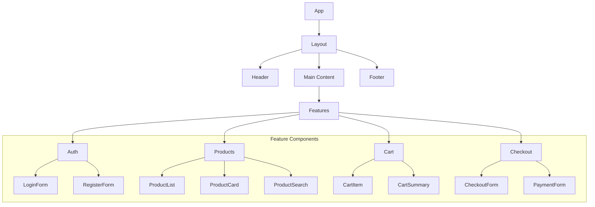
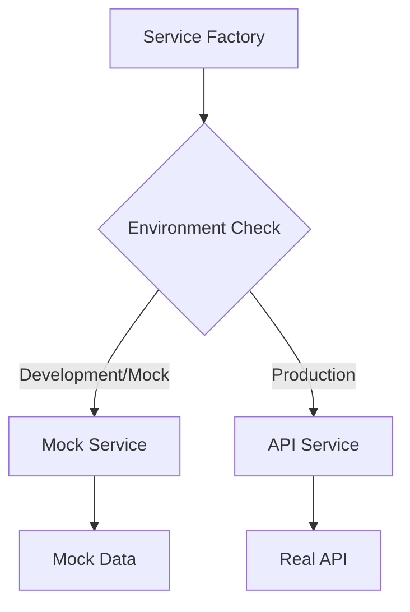

# Trinity Frontend

A modern, accessible, and dark-mode compatible SolidJS application with a component library built using Tailwind CSS.

## 📋 Table of Contents

- [Features](#features)
- [Project Structure](#project-structure)
- [Component Architecture](#component-architecture)
- [State Management](#state-management)
- [Getting Started](#getting-started)
- [Development](#development)
- [Best Practices](#best-practices)
- [Component Best Practices](#component-best-practices)
- [Code Best Practices](#code-best-practices)

## ✨ Features

- 🎨 Modern UI with dark mode support
- 📱 Responsive design
- ♿ Accessibility focused
- 🔍 Type-safe with TypeScript
- 🎯 Component-driven development
- 🔄 Efficient state management
- 🚀 Fast development workflow
- ✨ Smooth, accessible animations with tailwindcss-motion

### 🎭 Animation System

Trinity uses the `tailwindcss-motion` plugin to provide smooth, performant, and accessible animations throughout the application. Key features include:

- **Base Animations**: Fade, slide, scale, and rotate animations with configurable parameters
- **Animation Presets**: Common patterns like pulse, bounce, and slide-up for quick implementation
- **Modifiers**: Control duration, delay, easing, and loop behavior
- **Property-Specific Control**: Apply different timing to different properties
- **Accessibility**: Automatic reduced motion support
- **Performance**: Hardware-accelerated animations by default

For detailed examples and best practices, see the [Animation System Guide](FEATURES_GUIDE.md#-animation-system).

## 🏗 Project Structure

```
src/
├── assets/              # Static assets
│   └── images/         # Image files
├── components/          # UI components
│   ├── ui/            # Base UI components
│   ├── common/        # Shared components
│   ├── forms/         # Form components
│   ├── layout/        # Layout components
│   └── features/      # Feature components
├── hooks/              # Custom hooks
├── lib/                # Utilities
├── routes/             # Page components
├── services/           # API services
├── stores/             # State management
├── types/              # TypeScript types
└── app.tsx             # Root component
```

## 🎨 Component Architecture



## 🎭 Animation System

Trinity uses the `tailwindcss-motion` plugin for smooth, accessible animations:

### Key Features

- 🎨 Motion-safe animations that respect user preferences
- 🔄 Smooth transitions and transforms
- ⚡ Performance-optimized animations
- 🎯 Component-specific animation patterns
- 📱 Mobile-friendly animations
- ♿ Accessibility-first approach

### Example Usage

```tsx
// Fade in with duration
<div class="motion-safe:animate-fade-in motion-safe:animate-duration-300">
  {/* Content */}
</div>

// Slide in from right
<div class="motion-safe:animate-slide-in-right motion-safe:animate-duration-300">
  {/* Content */}
</div>

// Interactive hover states
<button class="motion-safe:hover:scale-105 motion-safe:active:scale-95 transition-transform duration-200">
  Click me
</button>

// Staggered list animations
<For each={items}>
  {(item, index) => (
    <div
      class="motion-safe:animate-fade-in motion-safe:animate-duration-300"
      style={{ "--delay": `${index() * 100}ms` }}
    >
      {item}
    </div>
  )}
</For>
```

### Animation Best Practices

1. Use `motion-safe:` prefix for all animations
2. Keep animations subtle and purposeful
3. Provide fallbacks for users with reduced motion
4. Use transform and opacity for better performance
5. Implement consistent timing across the app

For detailed animation documentation, see [Animation Guide](docs/FEATURES_GUIDE.md#animation-system).

## 🎭 State Management

We use a custom store implementation with SolidJS signals that ensures proper reactive context handling:

```typescript
// Store Implementation Pattern
// 1. State Signals
const [state, setState] = createSignal(initialState);

// 2. Actions
const actions = {
  updateState: (newState) => setState(prev => ({ ...prev, ...newState }))
};

// 3. Persistence Hook (used within components)
export const usePersistentStore = () => {
  createEffect(() => {
    // Persist state changes
    localStorage.setItem('store-key', JSON.stringify(state()));
  });
};

// 4. Store Hook
export const useStore = () => ({
  // Getters
  state,
  // Actions
  ...actions
});

// Usage in components:
const Component = () => {
  const store = useStore();
  // Initialize persistence if needed
  usePersistentStore();
  
  return <div>{store.state()}</div>;
};
```

Key Features:
- 🔄 Reactive state management with SolidJS signals
- 💾 Optional state persistence
- 🔒 Type-safe implementation
- ⚡ Proper reactive context handling
- 🧩 Modular and composable

## 🔌 Services & Mocking

### Service Architecture

The application uses a service layer pattern with mock capabilities for development and testing. The architecture is designed to easily switch between mock and real API implementations.



### Service Structure
```
services/
├── api/                 # Real API implementations
│   └── products.service.ts
├── mock/               # Mock service implementations
│   └── products.mock.service.ts
├── service.factory.ts  # Service creation & configuration
└── types/             # Service interfaces
    └── services.ts
```

### Using Mock Services

The mock service system provides:
- Realistic API behavior simulation
- Configurable network delays
- Random error simulation
- Type-safe implementations
- Easy switching between mock and real APIs

#### Configuration

Mock services can be configured using environment variables:

```env
# Force mock service usage
VITE_USE_MOCK=true

# API configuration
VITE_API_KEY=your_api_key
```

#### Environment-based Configuration

```typescript
// service.factory.ts
const config = {
    development: {
        baseUrl: "http://localhost:3000/api"
    },
    staging: {
        baseUrl: "https://staging-api.example.com"
    },
    production: {
        baseUrl: "https://api.example.com"
    }
};
```

#### Mock Service Features

1. **Simulated Network Behavior**
   ```typescript
   // Configurable delay simulation
   await simulateDelay(500); // 500ms delay
   
   // Random error simulation (20% chance)
   simulateError();
   ```

2. **Type-Safe Interface**
   ```typescript
   interface ProductService {
       getProducts(): Promise<Product[]>;
       getProduct(id: string): Promise<Product | null>;
       searchProducts(query: string): Promise<Product[]>;
   }
   ```

3. **Mock Data Management**
   ```typescript
   // mocks/products.mock.ts
   export const mockProducts = [
       {
           id: "1",
           name: "Product",
           // ...
       }
   ];
   ```

### Switching to Real API

To use the real API implementation:

1. Set environment variables:
   ```env
   VITE_USE_MOCK=false
   VITE_API_KEY=your_api_key
   ```

2. Update API configuration in `service.factory.ts`:
   ```typescript
   const config = {
       production: {
           baseUrl: "https://your-api-url.com"
       }
   };
   ```

3. The application will automatically use the real API service with no component changes needed.

### Best Practices

1. **Service Usage in Stores**
   ```typescript
   const productService = createProductService();
   
   export const useProducts = () => {
       const fetchProducts = async () => {
           try {
               const products = await productService.getProducts();
               // Handle success
           } catch (error) {
               // Handle error
           }
       };
       // ...
   };
   ```

2. **Error Handling**
   ```typescript
   try {
       await productService.getProduct(id);
   } catch (error) {
       if (error instanceof ApiError) {
           // Handle API-specific error
       }
       // Handle general error
   }
   ```

3. **Testing with Mocks**
   ```typescript
   // Force mock service in tests
   process.env.VITE_USE_MOCK = "true";
   
   test("fetches products", async () => {
       const service = createProductService();
       const products = await service.getProducts();
       expect(products).toBeDefined();
   });
   ```

## 🔧 Available Scripts

- `pnpm dev` - Start development server
- `pnpm build` - Build for production
- `pnpm test` - Run tests
- `pnpm lint` - Run linter
- `pnpm format` - Format code

## 📦 Dependencies

- SolidJS - UI framework
- Tailwind CSS - Styling
- TypeScript - Type safety
- Vite - Build tool

## Documentation

### Router Configuration
For detailed information about our routing setup and best practices, see [Router Documentation](src/docs/router.md).

### Development

#### Getting Started
1. Install dependencies:
```bash
pnpm install
```

2. Start the development server:
```bash
pnpm dev
```

#### Building
```bash
pnpm build
```

### Project Structure
- `/src` - Source code
  - `/components` - Reusable components
  - `/pages` - Page components
  - `/stores` - State management
  - `/lib` - Utilities and helpers
  - `/docs` - Project documentation

### Technologies
- SolidJS
- TailwindCSS
- @solidjs/router
- TypeScript

# Trinity E-commerce Platform

A modern e-commerce platform built with SolidJS, focusing on healthy food products with nutrition information.

## Test Users & Access Levels

For testing purposes, the following user accounts are available:

### Super Admin
- **Email:** admin@trinity.com
- **Password:** admin123
- **Access Level:** Full system access
- **Capabilities:**
  - ✅ Access admin dashboard
  - ✅ Manage all users (create, edit, delete)
  - ✅ Manage products (create, edit, delete)
  - ✅ Manage orders
  - ✅ Access system settings
  - ✅ Create other admin users
  - ✅ Access all user features
  - ✅ Modify system configurations

### Store Admin
- **Email:** manager@trinity.com
- **Password:** manager123
- **Access Level:** Limited administrative access
- **Capabilities:**
  - ✅ Access admin dashboard
  - ✅ View users
  - ✅ Manage products (create, edit)
  - ✅ Manage orders
  - ✅ View settings
  - ❌ Create/delete admin users
  - ❌ Modify system configurations
  - ✅ Access all user features

### Regular User
- **Email:** user@trinity.com
- **Password:** user123
- **Access Level:** Standard user access
- **Capabilities:**
  - ✅ View products
  - ✅ Place orders
  - ✅ Manage own profile
  - ✅ View order history
  - ✅ Access shopping cart
  - ❌ Access admin features
  - ❌ Modify system settings

### Inactive User
- **Email:** inactive@trinity.com
- **Password:** inactive123
- **Access Level:** No access (disabled account)
- **Capabilities:**
  - ❌ Cannot log in
  - ❌ No access to any features
  - ℹ️ Will receive "Account is inactive" message

## Available Routes

### Public Routes
- `/` - Home page
- `/products` - Product listing
- `/categories` - Product categories
- `/products/:id` - Product details
- `/login` - Login page
- `/register` - Registration page
- `/showcase` - Component showcase and test user interface

### Protected Routes (Requires Authentication)
- `/dashboard` - User dashboard
- `/profile` - User profile management
- `/orders` - Order history
- `/checkout` - Checkout process

### Admin Routes (Requires Admin Access)
- `/admin` - Admin dashboard
- `/admin/users` - User management
- `/admin/products` - Product management
- `/admin/orders` - Order management
- `/admin/settings` - System settings

## Testing the Different Roles

1. Visit the `/showcase` page to access the role testing interface
2. Use the provided test accounts to log in with different roles
3. Observe how the UI and available features change based on the user's role
4. Test accessing different routes to verify permission enforcement

### Role-Based Access Control

The system implements the following access control features:
- Automatic redirect to login for unauthenticated users
- Route protection based on user roles
- Dynamic UI adaptation based on permissions
- Proper error handling for unauthorized access
- Session management with "remember me" functionality

### Testing Notes

1. **Super Admin Testing:**
   - Can access all features
   - Test user creation and role assignment
   - Verify system settings modifications

2. **Store Admin Testing:**
   - Verify limited admin capabilities
   - Test product management features
   - Confirm restricted access to sensitive settings

3. **Regular User Testing:**
   - Verify standard e-commerce functionality
   - Test order placement and history
   - Confirm admin route restrictions

4. **Inactive User Testing:**
   - Verify login restrictions
   - Test error message display
   - Confirm account status handling

## Security Features

- Role-based access control (RBAC)
- Session management
- Secure route protection
- Password validation
- Account status checking
- Error handling for unauthorized access

## Development Notes

- All test users are part of the mock authentication system
- User data persists in localStorage for testing
- Password validation requires minimum 6 characters
- Session tokens expire after 24 hours
- "Remember me" functionality available for persistent login

## Additional Information

For more detailed information about specific features or implementation details, please refer to the following documentation:
- [Authentication System](./docs/auth.md)
- [Admin Features](./docs/admin.md)
- [User Management](./docs/users.md)
- [Product System](./docs/products.md)
- [Order Processing](./docs/orders.md)
